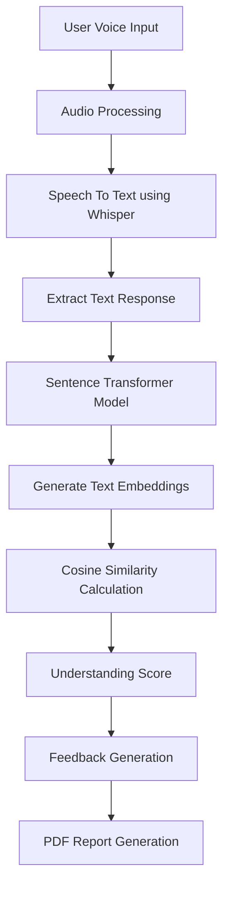

# 🎙️ Voice Based Concept Understanding Analyser (VBCUA)


## 📌 Project Title

# Voice Based Concept Understanding Analyser

---

## 📖 Project Overview

**Voice Based Concept Understanding Analyser (VBCUA)** is an AI-powered application designed to evaluate a user's conceptual understanding through voice responses.

The system allows users to answer questions verbally. The voice input is converted into text using Speech Recognition technology. The generated text is then analyzed using Natural Language Processing (NLP) techniques and compared with a predefined reference answer using semantic similarity algorithms.

The system calculates an understanding score and provides intelligent feedback based on the user's response quality.

This project demonstrates the application of **Artificial Intelligence, Machine Learning, Speech Processing, and NLP** for automated learning assessment.

---

# ❓ Problem Statement

Traditional evaluation methods require manual checking of answers, which is time-consuming and may not accurately measure a student's conceptual understanding.

There is a need for an automated AI-based system that can:

- Understand voice-based responses
- Analyze the meaning behind answers
- Evaluate conceptual knowledge
- Provide instant feedback

---

# 🎯 Objectives

The main objectives of this project are:

- Convert voice responses into text automatically.
- Analyze the semantic meaning of user answers.
- Compare responses with expected answers.
- Generate an understanding score.
- Provide personalized feedback.
- Reduce manual evaluation effort.

---

# 💡 Proposed Solution

The proposed system uses Artificial Intelligence techniques to analyze voice-based answers.

The workflow consists of:

1. User provides a voice response.
2. Speech recognition converts audio into text.
3. NLP models generate text embeddings.
4. Semantic similarity is calculated between user answer and reference answer.
5. The system generates an understanding score.
6. Feedback is provided based on performance.
7. A report can be generated for evaluation.

---

# 🏗️ System Architecture / Workflow



---

# ✨ Features

## 🎤 Voice Processing

- Accepts user voice responses.
- Converts speech into text automatically.

## 🤖 AI-Based Evaluation

- Uses NLP models for understanding responses.
- Evaluates answers based on meaning rather than exact words.

## 📊 Similarity Score

- Calculates semantic similarity between:
  - User answer
  - Expected answer

## 📝 Feedback Generation

Provides feedback such as:

- Excellent Understanding
- Good Understanding
- Average Understanding
- Needs Improvement

## 📄 Report Generation

- Generates downloadable performance reports.
- Includes score and response details.

## 🖥️ User-Friendly Interface

- Interactive Streamlit-based interface.
- Easy upload and evaluation process.

---

# 🛠️ Technologies Used

| Technology | Purpose |
|------------|---------|
| Python | Programming Language |
| Google Colab | Development Environment |
| OpenAI Whisper | Speech-to-Text Conversion |
| Sentence Transformers (SBERT) | Text Embedding Generation |
| Cosine Similarity | Semantic Comparison |
| Streamlit | User Interface |
| ReportLab | PDF Report Generation |
| NLP | Text Understanding |
| Machine Learning | AI-Based Evaluation |

---

# 📂 Project Structure

```
Voice-Based-Concept-Understanding-Analyser/

│
├── app.py
│   └── Streamlit application

├── speech.py
│   └── Speech recognition module

├── similarity.py
│   └── Semantic similarity calculation

├── report.py
│   └── PDF report generation

├── requirements.txt
│
├── README.md
│
├── sample_audio/
│   └── example.wav
│
└── models/
    └── AI models
```

---

# ⚙️ Installation Instructions

## Step 1: Clone Repository

```bash
git clone https://github.com/yourusername/Voice-Based-Concept-Understanding-Analyser.git
```

## Step 2: Navigate to Project Folder

```bash
cd Voice-Based-Concept-Understanding-Analyser
```

## Step 3: Create Virtual Environment

```bash
python -m venv venv
```

Activate environment:

Windows:

```bash
venv\Scripts\activate
```

Linux/Mac:

```bash
source venv/bin/activate
```

---

# 📦 Requirements.txt

Create a file named:

```
requirements.txt
```

Add:

```
openai-whisper
torch
sentence-transformers
scikit-learn
streamlit
reportlab
numpy
pandas
pydub
```

Install dependencies:

```bash
pip install -r requirements.txt
```

---

# ▶️ How to Run the Project

Run Streamlit application:

```bash
streamlit run app.py
```

The application will open in your browser.

---

# 📌 Usage Instructions

1. Open the application.
2. Upload a voice recording.
3. Select or enter the correct answer.
4. Click on analyze.
5. The system will:
   - Convert audio into text.
   - Compare answers.
   - Generate similarity score.
   - Provide feedback.
6. Download the generated report.

---

# 📥 Sample Input and Output

## Input

### Question:

```
Explain Machine Learning.
```

### Expected Answer:

```
Machine Learning is a branch of Artificial Intelligence
that enables computers to learn from data.
```

### User Voice Response:

```
Machine learning allows computers to learn patterns
from data without explicit programming.
```

---

## Output

```
Converted Text:

Machine learning allows computers to learn patterns
from data without explicit programming.


Similarity Score:

87%


Feedback:

Excellent Understanding
```

---

# 🧠 Model Details

## 1. OpenAI Whisper

Purpose:

- Converts speech audio into text.
- Handles different accents and languages.

---

## 2. Sentence Transformer (SBERT)

Purpose:

- Converts sentences into numerical embeddings.
- Captures semantic meaning.

Model Used:

```
all-MiniLM-L6-v2
```

---

## 3. Cosine Similarity

Used to measure similarity between two text embeddings.

Formula:

```
Similarity = A.B / (||A|| ||B||)
```

Higher similarity indicates better conceptual understanding.

---

# ⚙️ Algorithm Explanation

### Step 1: Audio Input

User uploads voice response.

↓

### Step 2: Speech Recognition

Whisper model converts audio into text.

↓

### Step 3: Text Processing

The text is converted into embeddings using SBERT.

↓

### Step 4: Similarity Calculation

Cosine similarity compares:

```
User Answer vs Reference Answer
```

↓

### Step 5: Score Generation

Similarity percentage is calculated.

↓

### Step 6: Feedback

Performance level is displayed.

---

# 🚀 Future Enhancements

Future improvements include:

- Real-time voice recording.
- Multi-language support.
- AI-generated questions.
- Integration with Learning Management Systems.
- Advanced personalized recommendations.
- Student performance tracking dashboard.
- Deep learning-based grading models.

---

# 🌍 Applications

This system can be used in:

🎓 Educational Platforms

- Automated student assessment.
- Online learning evaluation.

🏢 Corporate Training

- Employee knowledge assessment.

🗣️ Interview Preparation

- AI-based answer evaluation.

📚 E-Learning Applications

- Personalized learning feedback.

---

# ⚠️ Limitations

- Requires good quality audio input.
- Accuracy depends on speech recognition quality.
- Semantic similarity does not completely replace human evaluation.
- Large AI models require computational resources.

---

# ✅ Conclusion

Voice Based Concept Understanding Analyser provides an intelligent approach for evaluating conceptual knowledge through voice responses.

By combining speech recognition, NLP, and machine learning techniques, the system can automatically analyze answers, calculate understanding levels, and provide meaningful feedback.

This project demonstrates how AI can improve automated assessment and personalized learning experiences.

---

# 👨‍💻 Author

**Your Name**

AI/ML Intern

SmartBridge Internship Project

---

⭐ If you found this project useful, consider giving it a star on GitHub!
